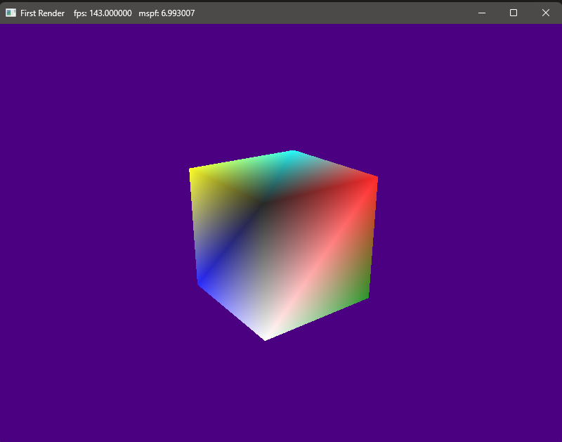

# DirectX12-MyApps

A simple box rendered using DirectX 12 API, created following the first chapters of the book "Introduction to 3D Game Programming with DirectX 12". To run it, open the BoxRenderer folder and compile Main.cpp

The controls are LMB to rotate the camera and RMB to zoom in and out. Press "W" To change model view to wireframe.
